# SehatPass 🏥

> **Smart, Unified Digital Healthcare & Patient Health Management Platform**

[](https://flutter.dev)
[](https://dart.dev)
[](https://supabase.com)
[](https://ai.google.dev)
[](https://android.com)
[](https://github.com/Arsalan3969/SehatPass)

---

## 📌 Overview

Healthcare journeys are often fragmented across disparate clinics, physical paper prescriptions, lost lab reports, and siloed communication. In emergency situations, first responders frequently lack immediate access to critical patient health data such as blood group, chronic conditions, and emergency contacts.

**SehatPass** solves this challenge by unifying patient health management into a cohesive, secure digital ecosystem. It seamlessly connects **patients**, **doctors**, **diagnostic records**, **medication schedules**, **context-aware AI health assistance**, and **lifesaving lock-screen emergency QR access**.

---

## 🚀 Key Features

| Category | Features |
| :--- | :--- |
| 🧑‍⚕️ **Patient Portal** | Unified home dashboard, personalized profile management, health metrics, appointment history, and real-time alerts. |
| 🩺 **Doctor Portal** | Dedicated clinical dashboard, daily appointment schedules, patient visit statistics, and clinical consultation note management. |
| 🔍 **Doctor Discovery** | Specialty search, clinic location filters, detailed doctor profiles, clinic photos, consultation fee details, and dynamic 15-minute slot booking. |
| 🗓️ **Appointment Lifecycle** | End-to-end appointment workflow (Requested &rarr; Confirmed &rarr; Completed / Cancelled) with cash-at-clinic payment support. |
| 📄 **Medical Reports** | Secure upload of PDF/image diagnostic reports, categorized storage, fast metadata indexing, and instant viewing via short-lived signed URLs. |
| 💊 **Medicine Management** | Active/completed medication logs, dosage tracking, frequency timing, and full prescription details. |
| ⏰ **Local Reminders** | Device-level, offline-capable scheduled medicine alarms with timezone support and privacy-conscious notification text. |
| 🔔 **Notification Center** | In-app notification hub for appointment updates, doctor consultation notes, medicine reminders, and clinical alerts. |
| 🤖 **Sehat AI Assistant** | Empathetic, context-aware AI assistant grounded on the patient's verified profile, active medications, lab reports, and doctor notes. |
| 🧪 **Report Explanation** | AI-driven breakdown of complex lab values (e.g., CBC, Lipid Profile) into clear, plain-language patient explanations. |
| 🚨 **Emergency QR System** | Dynamic, tokenized emergency QR code enabling first responders to instantly access lifesaving medical data without app login. |
| 📱 **Lock-Screen Emergency** | Native Android persistent notification and lock-screen overlay allowing first responders to access the emergency QR without unlocking the device. |
| 🔒 **Enterprise-Grade Security** | PostgreSQL Row Level Security (RLS), private Supabase Storage, scoped image resolution, and strict doctor-patient relationship isolation. |

---

## 📱 User Experience & Workflows

### 🧑 Patient Experience
1. **Onboarding & Health Profile:** Quick sign-up and setup of essential health metrics: date of birth, blood group, known allergies, chronic conditions, and emergency contact.
2. **Doctor Discovery & Booking:** Search doctors by specialty, review clinic facilities and consultation fees, select available time slots, and receive confirmation.
3. **Medication Tracking & Alerts:** Register medications and dosage times; receive automated daily notifications even when offline.
4. **Diagnostic Reports & AI Explanations:** Upload lab test results (PDF/images), organize by category, and tap *Explain with Sehat AI* for an instant plain-language breakdown.
5. **Emergency Readiness:** Activate Lock-Screen Emergency Access so vital medical info (allergies, blood group, emergency contact) is instantly accessible to paramedics.

### 🩺 Doctor Experience
1. **Clinical Onboarding:** Set up specialty, qualification, experience, consultation fee, clinic address, and clinic facility images.
2. **Schedule & Availability:** Configure daily consulting hours and automated 15-minute appointment slots.
3. **Appointment Management:** Review incoming booking requests, accept or reschedule visits, and track today's scheduled consultations.
4. **Scoped Patient Records:** Access diagnostic history and past reports exclusively for patients with active or confirmed appointments.
5. **Consultation Notes:** Record visit diagnoses, clinical observations, and prescribed medications directly into the patient's permanent record.

---

## 🚨 Emergency QR & Lock-Screen Access

SehatPass features a dedicated emergency access mechanism designed for high-stress, rapid-response situations:

```
[ Locked Smartphone ]
         │
         ▼ (Tap Lock-Screen Notification)
[ Emergency QR Display ] ──(Paramedic Scans)──► [ Secure Web Viewer ]
                                                        │
                                                        ▼
                                           • Blood Group & Demographics
                                           • Critical Allergies & Conditions
                                           • Emergency Contact (1-Tap Call)
                                           • Active Emergency Medications
                                           • Emergency Diagnostic Reports
```

### Privacy & Security Model
- **Tokenized Access:** The QR code does **not** store raw medical records. Instead, it embeds a secure, opaque UUID token pointing to an authenticated Supabase Edge Function (`/emergency-access`).
- **Scoped Data Retrieval:** The emergency endpoint returns only emergency-permitted fields (blood group, allergies, emergency contacts, vital medicines) and redacts all non-emergency records.
- **Revocable & Ephemeral:** Patients can deactivate or regenerate their emergency token at any time. Attached medical reports are delivered via short-lived signed URLs (10-minute expiry).
- **Android Native Integration:** Implemented via Android `NotificationChannel` with `VISIBILITY_PUBLIC` and a dedicated `EmergencyQrActivity` configured to show over the lock screen (`showWhenLocked`).

---

## 🤖 Sehat AI: Context-Aware Intelligence

**Sehat AI** delivers intelligent, clinically grounded assistance powered by Google Gemini and Supabase:

- **Patient Health Context Injection:** Automatically infers and injects verified patient health data (demographics, active medicines, known allergies, recent lab reports, doctor consultation notes) into the LLM context for personalized answers.
- **Retrieval-Augmented Generation (RAG):** General medical inquiries query an indexed medical knowledge base stored in PostgreSQL with `pgvector` embeddings (`gemini-embedding-001`).
- **Clinical Safety Boundaries:** Hardened system instructions enforce non-diagnostic disclaimers, recognize emergency red-flag symptoms (directing users to emergency services), and defend against prompt injection.
- **Zero Secrets in Mobile Client:** The mobile app communicates exclusively with a hardened Supabase Edge Function (`sehat-ai`), keeping API keys and service credentials securely on the server.

---

## 🔔 Notification Architecture

SehatPass utilizes a multi-tiered notification system:

1. **Local Medicine Reminders (`flutter_local_notifications`):**
   - Precise minute-level daily scheduling using the device's local timezone (`timezone` package).
   - Operates completely offline without requiring persistent background server connections.
   - Privacy-conscious notification text prevents disclosure of sensitive medical details on lock-screen previews.
2. **Event-Driven Database Triggers:**
   - PostgreSQL triggers automatically generate notifications when appointments change status (e.g., requested, confirmed, cancelled).
   - Notifies patients when a doctor publishes new consultation notes.
3. **In-App Notification Center:**
   - Dedicated notification feed in the app with unread badges, timestamps, and deep linking to relevant screens.

---

## 🔒 Security & Data Privacy

- **Supabase Authentication:** Secure email/password authentication with JWT validation on all client and server requests.
- **PostgreSQL Row Level Security (RLS):** Every database table is protected by strict RLS policies. Patients can only access their own records; doctors can only access records of patients with confirmed appointments.
- **Private Storage Buckets:** Medical reports, profile pictures, and clinic images are stored in private Supabase Storage buckets.
- **Signed URL Access:** Images and PDF documents are never publicly exposed; they are accessed exclusively through time-limited cryptographic signed URLs.
- **Role Isolation:** Enforced separation between patient and doctor roles prevents unauthorized privilege escalation.

---

## 🛠️ Technology Stack

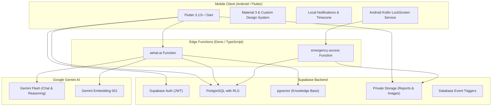

### Tech Stack Breakdown
- **Frontend / Mobile:** Flutter 3.13+, Dart 3.1+, Material 3, `syncfusion_flutter_pdf`, `qr_flutter`, `image_picker`, `flutter_local_notifications`, `timezone`.
- **Native Android:** Kotlin, `androidx.core`, `LockScreenEmergencyManager`, `EmergencyQrActivity`.
- **Backend & Database:** Supabase, PostgreSQL 15+, `pgvector`, Row Level Security (RLS), Database Triggers & Functions.
- **Serverless Compute:** Supabase Edge Functions (Deno, TypeScript).
- **AI & ML:** Google Gemini (`gemini-3.6-flash`, `gemini-embedding-001`).
- **Storage:** Supabase Storage (Private buckets: `medical-reports`, `profile-images`, `clinic-images`).
- **Emergency Web Viewer:** Lightweight, responsive static web app (`emergency-web`).

---

## 📁 Project Structure

```
SehatPass/
├── android/                   # Android native code, Manifest & LockScreen services
│   └── app/src/main/kotlin/   # Kotlin LockScreenEmergencyManager & EmergencyQrActivity
├── emergency-web/             # Standalone web app for emergency QR scanning
├── lib/                       # Flutter application source code
│   ├── app/                   # App shell, routing & application root
│   ├── auth/                  # Authentication gates & session controllers
│   ├── core/                  # Design system, themes, colors & constants
│   ├── features/              # Feature modules
│   │   ├── appointments/      # Booking, doctor discovery & appointment lifecycle
│   │   ├── auth/              # Login, registration & role selection
│   │   ├── doctor/            # Doctor dashboard, patients, profile & notes
│   │   ├── emergency_qr/      # Emergency QR display & lock-screen management
│   │   ├── home/              # Patient home dashboard & quick actions
│   │   ├── medicines/         # Medicine tracking & prescription management
│   │   ├── notifications/     # In-app notification center & history
│   │   ├── profile/           # Patient health profile & avatar management
│   │   ├── reports/           # Medical report upload, categorization & viewing
│   │   └── sehat_ai/          # Sehat AI chat, report explainer & RAG client
│   ├── services/              # Notification, Image upload & Supabase client services
│   └── shared/                # Reusable widgets (AppUserAvatar, Buttons, Inputs)
├── supabase/                  # Backend infrastructure
│   ├── functions/             # Deno TypeScript Edge Functions (sehat-ai, emergency-access)
│   ├── knowledge_seed/        # Curated medical knowledge vector dataset
│   └── migrations/            # Version-controlled PostgreSQL SQL migrations
├── test/                      # Comprehensive test suite (330+ unit & widget tests)
└── pubspec.yaml               # Flutter package configuration & dependencies
```

---

## 💻 Local Setup & Installation

### Prerequisites
- [Flutter SDK](https://docs.flutter.dev/get-started/install) (`>= 3.13.1`)
- [Dart SDK](https://dart.dev/get-dart) (`>= 3.1.0`)
- [Android Studio](https://developer.android.com/studio) / Android SDK
- A [Supabase](https://supabase.com) project with database migrations applied

### 1. Clone the Repository
```bash
git clone https://github.com/Arsalan3969/SehatPass.git
cd SehatPass
```

### 2. Install Dependencies
```bash
flutter pub get
```

### 3. Configure Environment Variables
Copy `.env.example` to `.env` in the root directory:
```bash
cp .env.example .env
```

Populate `.env` with your project credentials:
```env
# Supabase Configuration
SUPABASE_URL=https://your-project.supabase.co
SUPABASE_PUBLISHABLE_KEY=your_supabase_anon_publishable_key

# Public Emergency Web App URL
EMERGENCY_WEB_URL=https://your-emergency-web-app.vercel.app
```

> ⚠️ **Note:** Never commit `.env` or any production secrets to version control.

### 4. Run the Application
```bash
# Run on connected Android device or emulator
flutter run
```

---

## 📱 Download SehatPass

### Latest Release — v1.0.0

[⬇️ Download Android APK (v1.0.0)](https://github.com/Arsalan3969/SehatPass/releases/latest)

> 💡 **Release Assets:** You can also find all release notes and APK binaries in the [GitHub Releases](https://github.com/Arsalan3969/SehatPass/releases) section.

To build the release APK locally:
```bash
flutter build apk --release
```
The compiled binary will be located at:
`build/app/outputs/flutter-apk/app-release.apk`

---

## 📸 Screenshots

### 🧑 Patient Experience & Appointments
<p align="center">
  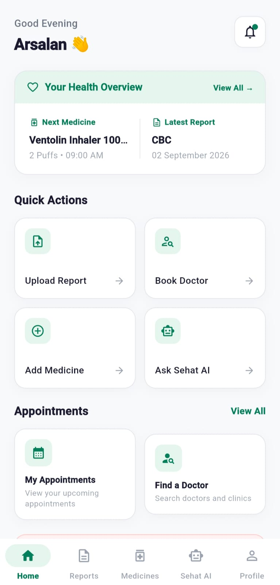
  &nbsp;
  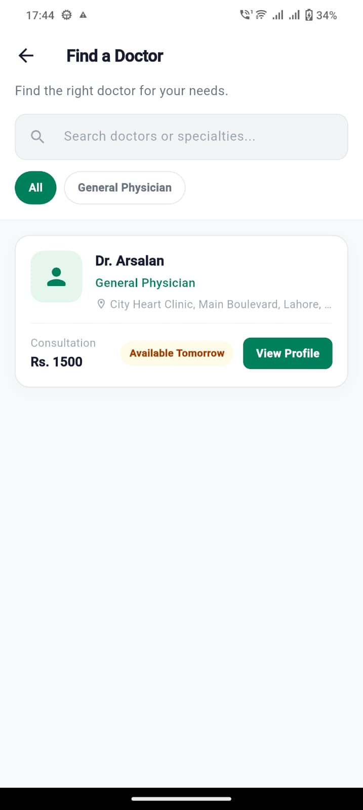
  &nbsp;
  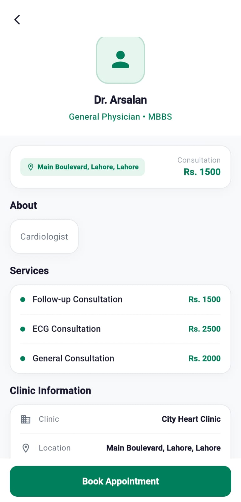
  &nbsp;
  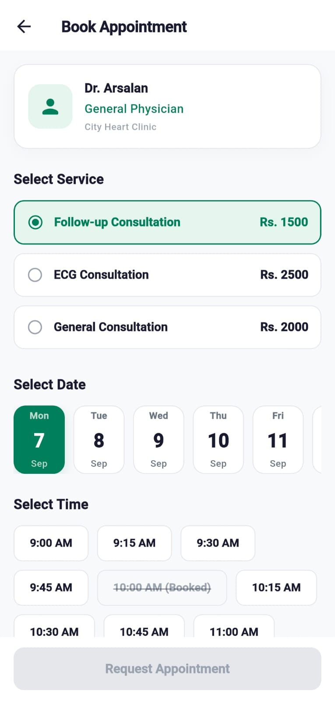
</p>

### 🩺 Health Records & Sehat AI
<p align="center">
  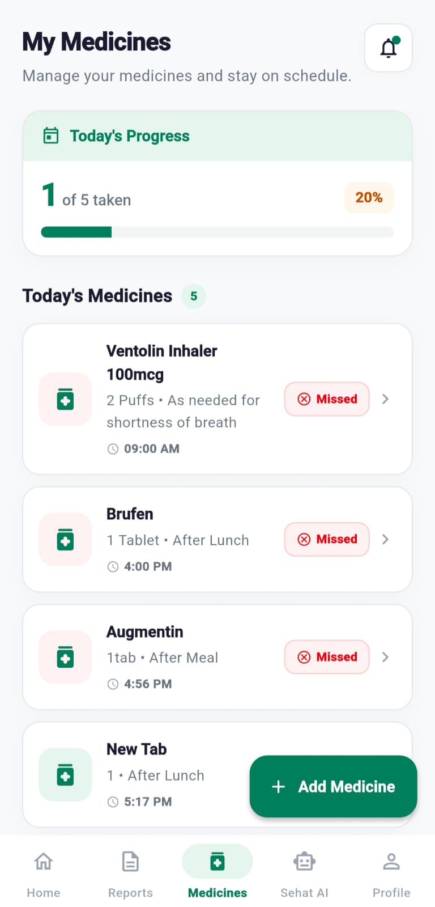
  &nbsp;
  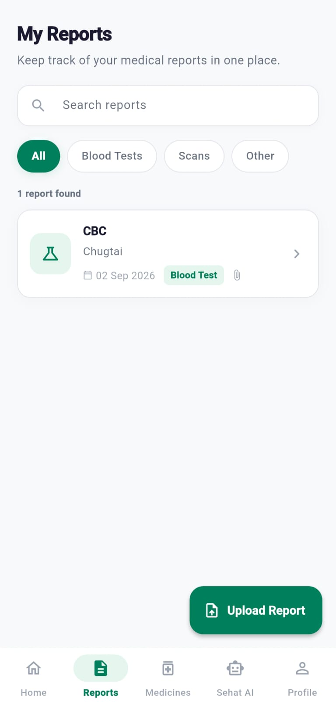
  &nbsp;
  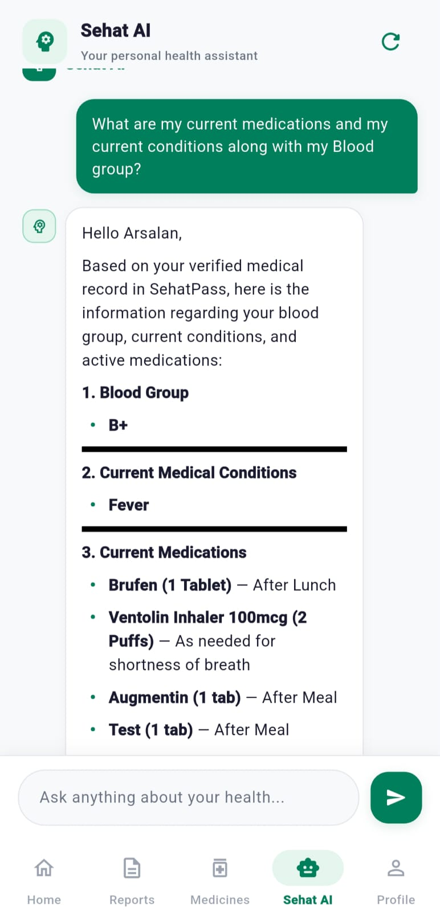
</p>

### 👨‍⚕️ Doctor Clinical Portal
<p align="center">
  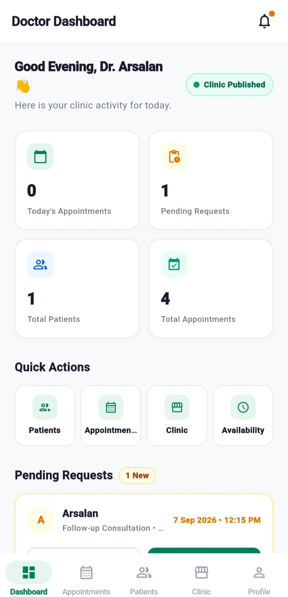
  &nbsp;
  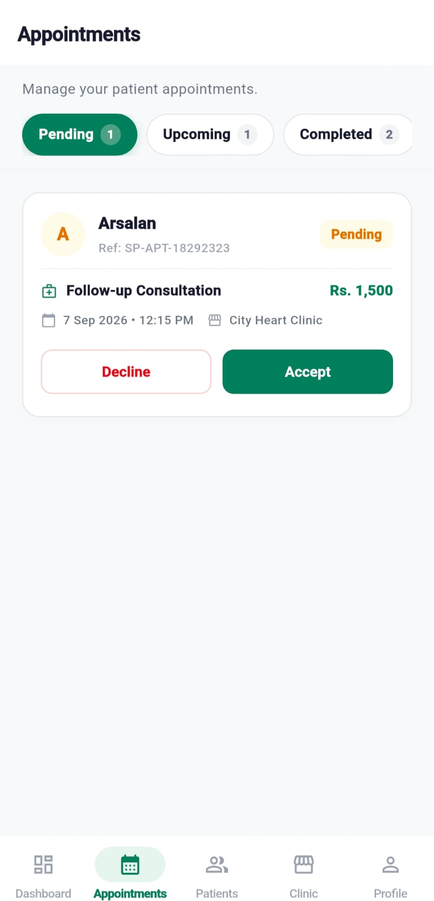
  &nbsp;
  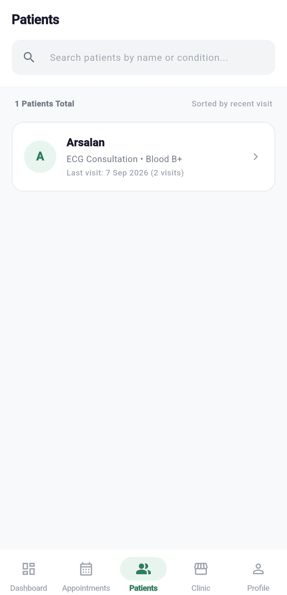
  &nbsp;
  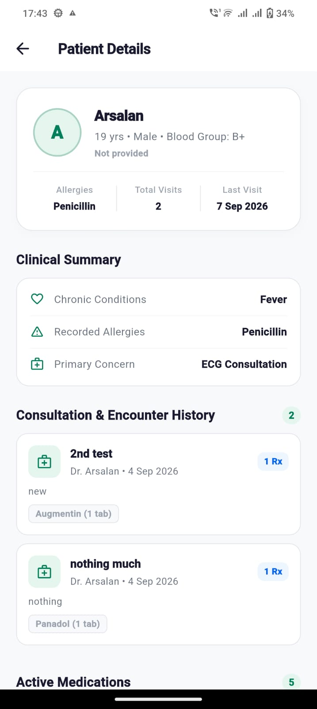
</p>

---

## 🧪 Testing & Verification

The SehatPass codebase is thoroughly validated with an automated test suite:

- **Static Analysis:** `flutter analyze` &mdash; **0 issues found**
- **Automated Tests:** **332 / 332 tests passed** across all modules:
  - Auth flow & role-based routing tests
  - Dynamic doctor availability & booking tests
  - Doctor patient access & consultation note tests
  - Emergency QR tokenization & channel isolation tests
  - Medicine scheduling & timezone minute-level reminder tests
  - Sehat AI context assembly, RAG parsing & safety boundary tests
  - Image upload, signed URL resolution & widget smoke tests

To run the test suite locally:
```bash
flutter test
```

---

## 👥 Authors & Contributors

- **Muhammad Arsalan Bin Tariq** &mdash; [@Arsalan3969](https://github.com/Arsalan3969)

---

## 🔗 Repository & Contact

- **GitHub Repository:** [https://github.com/Arsalan3969/SehatPass](https://github.com/Arsalan3969/SehatPass)
- **Issues & Feedback:** [https://github.com/Arsalan3969/SehatPass/issues](https://github.com/Arsalan3969/SehatPass/issues)
